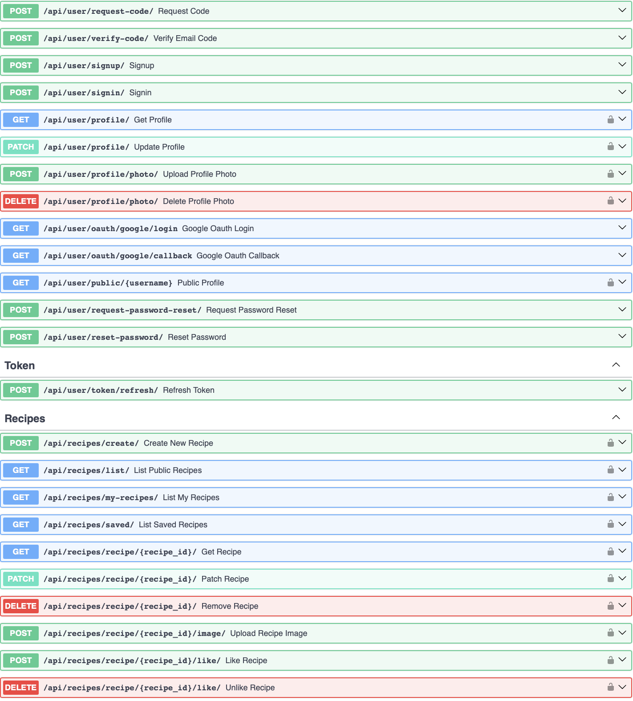

# Share Recipe - Backend

FastAPI backend for the Share Recipe application. Provides REST API for user authentication (email + Google OAuth), recipe management (create, update, like, save, comment), ingredients, feedback collection, and admin interface. Uses PostgreSQL for persistence, Redis for caching / short‑lived codes, JWT for auth tokens, Alembic for migrations, and SQLAdmin for lightweight admin panel.



## Frontend Repository
- https://github.com/bdaniyar/frontend-share_recipe-for_vercel
Recommend to deploy on Vercel

## Fullstack Repository
A combined repository (frontend + backend + infra) with broader documentation:
- https://github.com/bdaniyar/fullstack-share_recipe

## Features
- User signup with email verification codes (Redis TTL) and password reset
- Google OAuth (PKCE) login
- JWT access + refresh tokens
- Profile update with avatar upload (served via /media)
- Recipe CRUD with image upload, like & save, threaded comments (parent replies)
- Ingredient catalog + search and normalization
- Feedback submission & listing
- Daily posting limit per user (configurable)
- Admin panel (SQLAdmin) protected by username/password
- Swagger / ReDoc docs protected with HTTP Basic in production
- Structured logging
- Alembic migrations tracked in versioned directory

## Tech Stack
- FastAPI / Starlette
- PostgreSQL (async SQLAlchemy 2.x + asyncpg)
- Redis (verification codes, caching via fastapi-cache)
- Alembic (DB migrations)
- SQLAdmin (admin UI)
- JWT (python-jose) for tokens
- Docker & docker-compose for local multi-service setup


## Quick Start (Local, Without Docker)
Prerequisites: Python 3.11+, running PostgreSQL & Redis instances.

1. Create and fill `.env` in `share-recipe-frontend/backend/` (see `.env.example`).
2. Install deps:
   ```bash
   pip install -r share-recipe-frontend/backend/requirements.txt
   ```
3. Run migrations:
   ```bash
   cd share-recipe-frontend/backend
   alembic upgrade head
   ```
4. Start dev server:
   ```bash
   uvicorn app.main:app --reload --port 8000
   ```
5. Access (dev mode docs open): http://localhost:8000/docs

## Running with Docker (Backend + Postgres + Redis)
```bash
# Build image
docker build -t share-recipe-backend .
# or use compose (recommended for services)
docker compose up --build
```
Volumes:
- `./media` -> `/app/media` (persistent uploaded images)
- Named volume `recipe-db-data` for Postgres data (see compose)

The container entrypoint runs Alembic migrations automatically before starting Uvicorn.

## Environment Variables (.env Example)
Key variables (see `.env.example` for full list):
- DATABASE_URL=postgresql+asyncpg://postgres:postgres@db:5432/share_recipe
- SECRET_KEY=... (JWT & sessions)
- ALGORITHM=HS256
- REDIS_HOST=redis
- REDIS_PORT=6379
- SMTP_HOST / SMTP_PORT / SMTP_USER / SMTP_PASSWORD / EMAIL_FROM (email sending)
- OAUTH_GOOGLE_CLIENT_ID / OAUTH_GOOGLE_CLIENT_SECRET
- ADMIN_USERNAME / ADMIN_PASSWORD (admin panel auth)
- DOCS_USERNAME / DOCS_PASSWORD (protect Swagger/ReDoc in production)
- ENV=development (set to production to lock docs behind Basic Auth)

## API Docs Protection
When `ENV=production`: default FastAPI docs routes are disabled and re-exposed manually behind HTTP Basic. Use `DOCS_USERNAME` / `DOCS_PASSWORD`. In development they are open.

## Admin Panel
SQLAdmin is mounted (check implementation in `admin.py`). Authenticate using `ADMIN_USERNAME` / `ADMIN_PASSWORD` from environment.

## Media & File Uploads
- Profile photos stored under `/media/profile_photos`
- Recipe images stored under `/media/recipe_photos`
- `main.py` mounts the `media` directory; ensure it exists (compose creates via bind mount) or is created at runtime.
- Returned URLs are relative to server base (e.g., `/media/recipe_photos/<file>`)

## Google OAuth Flow
Implements PKCE. State token (signed JWT) carries the `next` redirect target + verifier and expires after 5 minutes. On success tokens (access, refresh) appended as query params to frontend redirect URL.

## Migrations
Create new migration:
```bash
alembic revision -m "add_new_table"
alembic upgrade head
```

## Tests
Basic tests live under `app/test/`. Run:
```bash
pytest -q
```
(Ensure a test database / fixtures are configured.)

## Deployment Notes
- Use the provided Dockerfile; set environment variables via platform (do NOT bake secrets into image)
- Provide external managed Postgres & Redis (or compose in staging)
- Mount or persist `/app/media` for user uploads
- Set `ENV=production` and credentials for docs/admin
- Ensure correct `DATABASE_URL` uses async driver (`+asyncpg`)

## Security Considerations
- Passwords hashed with bcrypt
- Email verification & reset codes short-lived in Redis
- Admin & docs separated from general API auth
- SECRET_KEY must be strong & rotated if leaked
